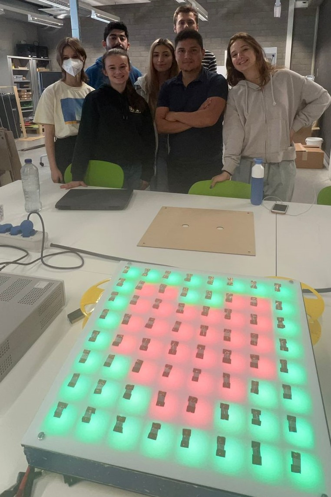

# **introduction**

In this document you're going to learn how the group managed to built the prototype step by step, Materials we used for this, the code I made  the hardware i used, things i used but didnt worked and connections. summarize, the failures i encountered and successes. I will also tell you my advise for the next group in order they can build it faster and succeed. The main reason is to improve the prototype and dont spend time on the problems i encountered. 

#### **Project**

in this project we needed to build something interactive, tangible and playfull. After spending weeks doing research we finally had our brainstorm week and we decides to make a led table/floor. We called this LED's play.

 

</img> 
 
